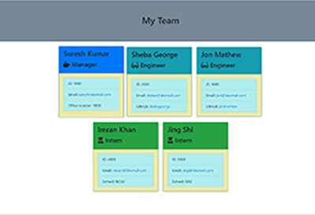

# Readme Generator App

[projectTeamGenerator walkthru video](https://drive.google.com/file/d/1nPlVIOv2-6reW6Xy9XvoDHafyBFrlbt6/view?usp=sharing)

 [projectTeamGenerator sample generated output](https://s-suresh-kumar.github.io/projectTeamGenerator/output/team.html)

## Table of Contents

- [Description](#Description)

- [Installation](#Installation)

- [Instructions](#Instructions)

- [License](#License)

- [Contribute](#Contribute)

- [Tests](#Tests)

- [Questions](#Questions)

## Description

This is a backend app that uses html templates, nodeJS and prompts the user using inquirer package for team members to be added into a team and finally generates and saves the team.html in output directory. 

## Installation

You need inquirer package installed for this app to run. So the steps are :

1. Clone this [repository](https://github.com/s-suresh-kumar/projectTeamGenerator)
2. Issue `npm i` at your local repository root, so that all dependencies (inquirer package) is installed.
3. Then launch node app.js and answer all questions properly.
4. Your team.html will be generated at the ./output directory.

## Instructions

Since this is a command line app, just run 'node app.js'. The app will ask for team member name, id, e-mail.  The app will validate if there is a duplicate id or if the id is not a number.  It only allows number for id and it has to be unique. Then it will ask the role of the team member. The prompt presents a choice list of 'Engineer', 'Intern' and 'Manager' as choices. User has to pick one role for the team member. Depending on the role, the app will ask additional info of 'Office Number' in case of Manager, 'github user name' in case of Engineer and 'School name' in case of Intern. Finally it prompts if the user want to add additional team members to the team.  A choice list of 'yes','no' is presented to the user. If the user chooses 'yes', it will ask the above questions for the new team member. In case the user chooses 'no', the team.html is generated and stored in ./output directory.
The app also validates and allows only one member with role 'Manager' as per user story requirement. Extra care is taken to see that cards are of equal width and height as well as the whole page is responsive across different screen sizes and viewports.

## License

This project is licensed under the [ISC](https://opensource.org/licenses/ISC) License.

## Contribute

Please use my e-mail to contact me on how to contribute to this project.

## Tests

There are no automated tests written for this app. However it is easy to launch the app and answer the questions, at the end team.html will be generated at the ./output directory.

## Questions

https://github.com/s-suresh-kumar

suresh01@yahoo.com
